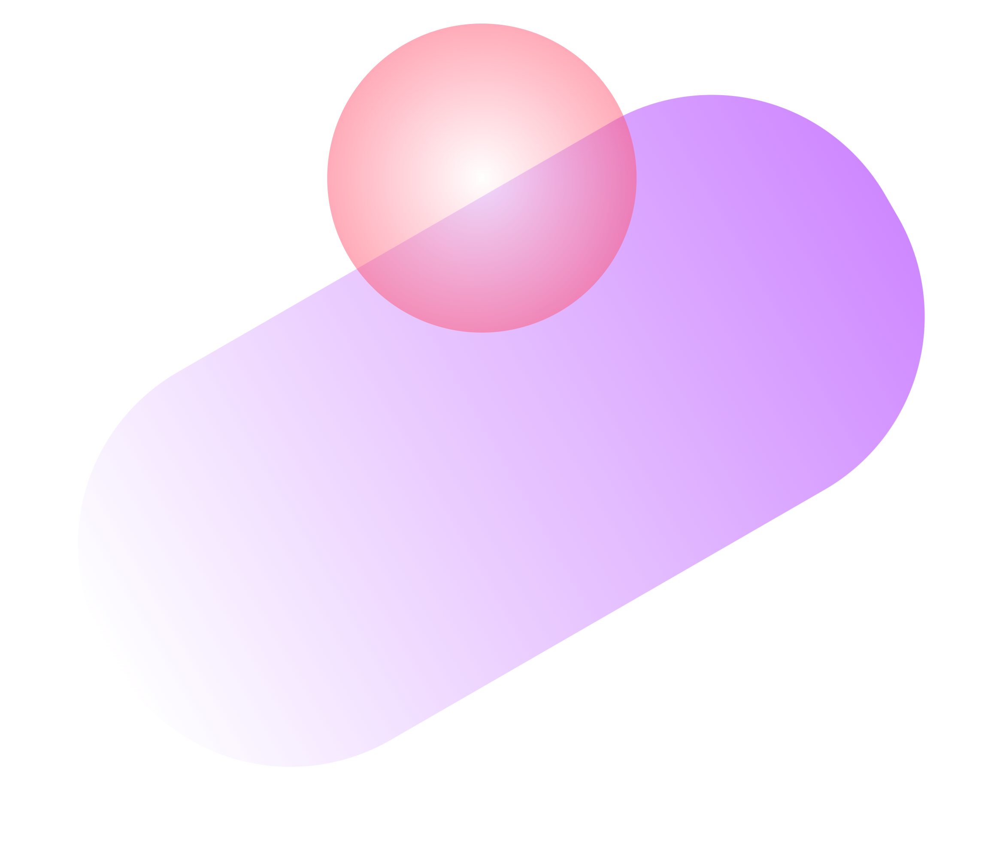

# </img> Contentfilter
Contentfilter is a free, open and fast content filter engine. You can use Contentfilter to filter content through predefined sieves for:

- Text
- Image
- Sound

Filters usually have many sieves, which are used to filter harmful or harmless content. For example, we can use `Contentfilter` to build a text filter, and then we can add many sensitive words to this filter. After it is constructed, we can filter the large batch of text to see what sensitive words are hit by this filter. 

APIs can be found in [How to Use Contentfilter](./docs/apis/how-to-use-contentfilter.md).
