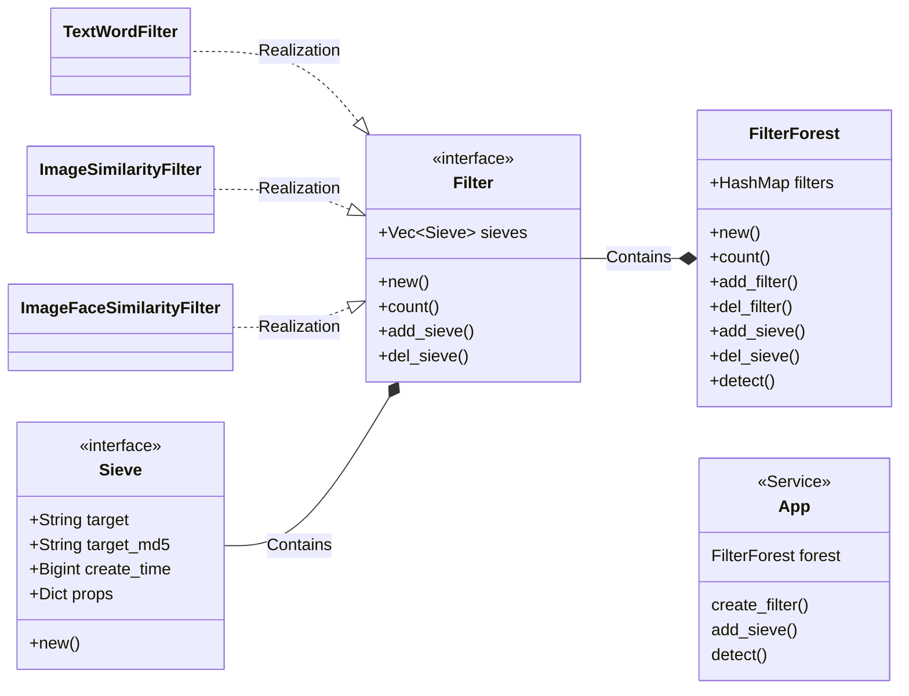

# Class Diagram

```mermaid
classDiagram
    direction RL

    class FilterForest
    class Filter
    FilterForest *-- Filter: Contains
    Filter <|.. TextWordFilter: Realization
    Filter <|.. ImageSimilarityFilter: Realization
    Filter <|.. ImageFaceSimilarityFilter: Realization
    Filter *-- Sieve: Contains

    class FilterForest{
        +HashMap filters
        +new()
        +count()
        +add_filter()
        +del_filter()
        +add_sieve()
        +del_sieve()
        +detect()
    }

    class Filter{
        <<interface>>
        +Vec~Sieve~ sieves

        +new()
        +count()
        +add_sieve()
        +del_sieve()
    }

    class Sieve{
        <<interface>>

        +String target
        +String target_md5
        +Bigint create_time
        +Dict props

        +new()
    }

    class App{
        <<Service>> 
        FilterForest forest

        create_filter()
        add_sieve()
        detect()
    }
```
